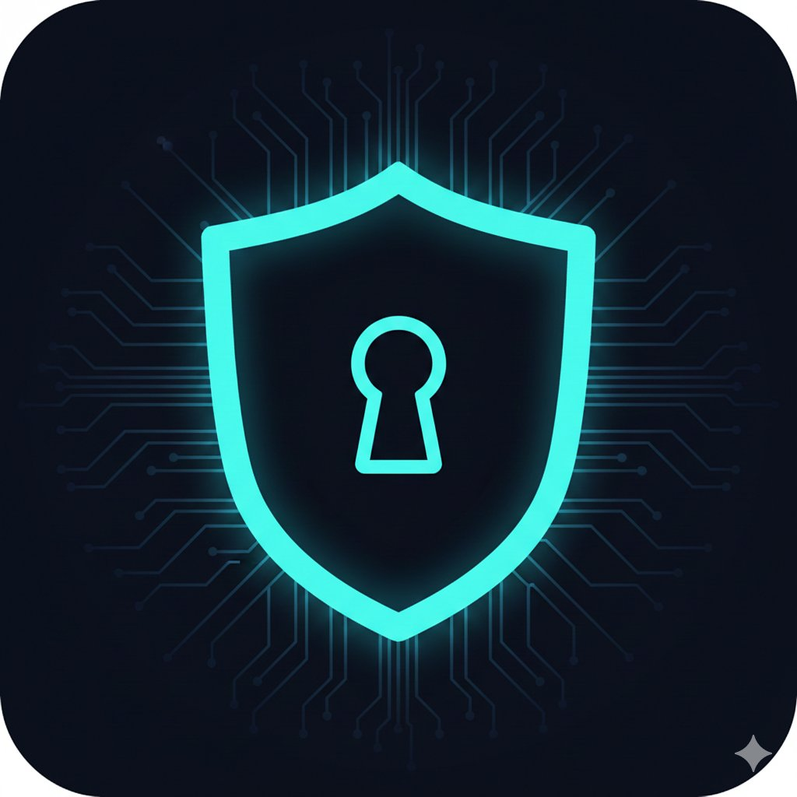

# QuantumShield Security Intelligence API

<p align="center">
  
</p>

<p align="center">
  <strong>x402-powered Web3 Security Scanner</strong><br>
  Real-time token security, honeypot detection, and wallet risk analysis
</p>

<p align="center">
  <a href="https://quantumshield-api.vercel.app">Live Demo</a> •
  <a href="#api-endpoints">API Docs</a> •
  <a href="#x402-integration">x402 Integration</a> •
  <a href="#pricing">Pricing</a>
</p>

---

## 🛡️ What is QuantumShield?

QuantumShield is a security intelligence API that helps developers, traders, and AI agents assess the safety of tokens, wallets, and smart contracts across multiple blockchains.

**Key Features:**
- 🔍 **7 Security Endpoints** - Token analysis, honeypot detection, wallet risk, and more
- ⚡ **x402 Micropayments** - Pay-per-request via USDC on Base (as low as $0.001)
- 🌐 **Multi-Chain** - Ethereum, Base, BSC, Arbitrum, Polygon
- 🚀 **Fast & Cached** - Sub-second responses with intelligent caching
- 🤖 **AI-Agent Ready** - Perfect for autonomous trading bots and agents

---

## 🚀 Quick Start

### Try the Demo
Visit [quantumshield-api.vercel.app](https://quantumshield-api.vercel.app) and run a demo scan - no payment required!

### API Request (with x402)
```bash
curl -X GET "https://quantumshield-api.vercel.app/api/token/security?address=0x833589fCD6eDb6E08f4c7C32D4f71b54bdA02913&chain=base" \
  -H "X-Payment: <your-x402-payment-header>"
```

### Demo Mode (no payment)
```bash
curl -X GET "https://quantumshield-api.vercel.app/api/token/security?address=0x833589fCD6eDb6E08f4c7C32D4f71b54bdA02913&chain=base&demo=true"
```

---

## 📊 API Endpoints

| Endpoint | Price | Description |
|----------|-------|-------------|
| [`/api/token/security`](#token-security) | $0.002 | Comprehensive token risk analysis |
| [`/api/honeypot/check`](#honeypot-check) | $0.001 | Honeypot detection with simulation |
| [`/api/wallet/risk`](#wallet-risk) | $0.002 | Wallet reputation and risk scoring |
| [`/api/contract/audit`](#contract-audit) | $0.003 | Smart contract security audit |
| [`/api/liquidity/check`](#liquidity-check) | $0.002 | Liquidity and rug pull risk |
| [`/api/whale/activity`](#whale-activity) | $0.002 | Whale and holder concentration |
| [`/api/pair/analysis`](#pair-analysis) | $0.002 | DEX pair safety analysis |

---

## 🔌 API Reference

### Token Security
`GET /api/token/security`

Comprehensive token risk analysis including honeypot detection, tax analysis, and ownership flags.

**Parameters:**
| Param | Type | Required | Description |
|-------|------|----------|-------------|
| `address` | string | Yes | Token contract address (0x...) |
| `chain` | string | No | Chain name or ID (default: `base`) |

**Example Response:**
```json
{
  "address": "0x833589fcd6edb6e08f4c7c32d4f71b54bda02913",
  "chain": "base",
  "chainId": "8453",
  "name": "USD Coin",
  "symbol": "USDC",
  "riskScore": 5,
  "riskLevel": "LOW",
  "risks": [],
  "warnings": ["upgradeable_proxy"],
  "metrics": {
    "holders": 245632,
    "lpHolders": 1823,
    "buyTax": 0,
    "sellTax": 0,
    "isOpenSource": true,
    "isProxy": true
  },
  "sources": {
    "goplus": true,
    "honeypot": true,
    "cached": false
  },
  "timestamp": "2025-01-02T15:30:00.000Z"
}
```

---

### Honeypot Check
`GET /api/honeypot/check`

Dedicated honeypot detection with buy/sell simulation.

**Parameters:**
| Param | Type | Required | Description |
|-------|------|----------|-------------|
| `address` | string | Yes | Token contract address |
| `chain` | string | No | Chain name or ID (default: `base`) |

**Example Response:**
```json
{
  "address": "0x...",
  "chain": "base",
  "isHoneypot": false,
  "status": "SAFE",
  "confidence": "HIGH",
  "taxes": {
    "buy": 0,
    "sell": 0,
    "total": 0,
    "hasAnyTax": false,
    "hasHighTax": false
  },
  "flags": {
    "cannotSell": false,
    "cannotBuy": false,
    "isProxy": false,
    "hiddenOwner": false,
    "selfDestruct": false,
    "hasTradingCooldown": false
  },
  "simulation": {
    "available": true,
    "riskLevel": 0,
    "liquidity": 5000000
  },
  "timestamp": "2025-01-02T15:30:00.000Z"
}
```

---

### Wallet Risk
`GET /api/wallet/risk`

Wallet reputation and risk scoring for addresses.

**Parameters:**
| Param | Type | Required | Description |
|-------|------|----------|-------------|
| `address` | string | Yes | Wallet address to analyze |
| `chain` | string | No | Chain (default: `ethereum`) |

**Example Response:**
```json
{
  "address": "0x...",
  "chain": "ethereum",
  "riskScore": 0,
  "riskLevel": "LOW",
  "risks": [],
  "riskCategories": [],
  "addressType": "eoa",
  "details": {
    "hasStealingAttack": false,
    "hasCybercrime": false,
    "hasPhishingActivity": false,
    "hasMoneyLaundering": false,
    "hasFinancialCrime": false,
    "hasDarkwebTx": false,
    "hasMaliciousMining": false,
    "isBlacklisted": false,
    "isHoneypotRelated": false,
    "hasFakeKYC": false
  },
  "summary": "No known risks detected",
  "timestamp": "2025-01-02T15:30:00.000Z"
}
```

---

### Contract Audit
`GET /api/contract/audit`

Comprehensive smart contract security audit with letter grading.

**Parameters:**
| Param | Type | Required | Description |
|-------|------|----------|-------------|
| `address` | string | Yes | Contract address |
| `chain` | string | No | Chain (default: `base`) |

**Example Response:**
```json
{
  "address": "0x...",
  "chain": "base",
  "name": "Example Token",
  "symbol": "EXT",
  "securityScore": 85,
  "grade": "A",
  "auditFlags": ["upgradeable_proxy", "mintable"],
  "flagCount": 2,
  "criticalIssues": [],
  "warnings": [
    "Contract is upgradeable - logic can change",
    "New tokens can be minted"
  ],
  "contractDetails": {
    "isOpenSource": true,
    "isProxy": true,
    "hasSelfdestruct": false,
    "hasExternalCalls": false,
    "creator": "0x...",
    "owner": "0x...",
    "totalSupply": "1000000000",
    "holderCount": 5432
  },
  "timestamp": "2025-01-02T15:30:00.000Z"
}
```

---

### Liquidity Check
`GET /api/liquidity/check`

Liquidity analysis and rug pull risk assessment.

**Parameters:**
| Param | Type | Required | Description |
|-------|------|----------|-------------|
| `address` | string | Yes | Token address |
| `chain` | string | No | Chain (default: `base`) |

**Example Response:**
```json
{
  "address": "0x...",
  "chain": "base",
  "rugPullRisk": 15,
  "riskLevel": "LOW",
  "warnings": ["partial_lp_locked"],
  "liquidity": {
    "totalLpLockedPercent": 65.5,
    "lpHolderCount": 12,
    "isLiquidityLocked": false,
    "lockStatus": "PARTIAL"
  },
  "topLpHolders": [
    {
      "address": "0x...",
      "percent": 45.2,
      "isLocked": true,
      "isContract": true,
      "tag": "Unicrypt"
    }
  ],
  "timestamp": "2025-01-02T15:30:00.000Z"
}
```

---

### Whale Activity
`GET /api/whale/activity`

Whale and holder concentration analysis.

**Parameters:**
| Param | Type | Required | Description |
|-------|------|----------|-------------|
| `address` | string | Yes | Token address |
| `chain` | string | No | Chain (default: `base`) |

**Example Response:**
```json
{
  "address": "0x...",
  "chain": "base",
  "concentrationRisk": 25,
  "riskLevel": "MEDIUM",
  "alerts": ["moderate_concentration"],
  "holderStats": {
    "totalHolders": 1523,
    "whaleCount": 8,
    "top10HoldPercent": 45.3,
    "distribution": "MODERATE"
  },
  "topHolders": [...],
  "whales": [...],
  "timestamp": "2025-01-02T15:30:00.000Z"
}
```

---

### Pair Analysis
`GET /api/pair/analysis`

DEX pair safety and trading analysis.

**Parameters:**
| Param | Type | Required | Description |
|-------|------|----------|-------------|
| `address` | string | Yes | Token address |
| `chain` | string | No | Chain (default: `base`) |

**Example Response:**
```json
{
  "address": "0x...",
  "chain": "base",
  "safetyScore": 85,
  "safetyGrade": "SAFE",
  "issues": ["has_taxes"],
  "pairs": [
    {
      "dex": "Uniswap V3",
      "pair": "USDC",
      "liquidity": 250000,
      "liquidityFormatted": "$250.00K"
    }
  ],
  "pairStats": {
    "totalPairs": 3,
    "totalLiquidity": 350000,
    "liquidityStatus": "HIGH"
  },
  "trading": {
    "buyTax": 1,
    "sellTax": 1,
    "isHoneypot": false,
    "canBuy": true,
    "canSellAll": true,
    "tradingStatus": "OPEN"
  },
  "timestamp": "2025-01-02T15:30:00.000Z"
}
```

---

## 💳 x402 Integration

QuantumShield uses the [x402 protocol](https://x402.org) for micropayments. This enables:
- **No API keys** - Pay per request with USDC
- **AI-agent compatible** - Autonomous payments without accounts
- **Transparent pricing** - Costs shown before payment

### How x402 Works

1. **Request without payment** → Receive `402 Payment Required`
2. **Response includes** payment instructions (amount, address, network)
3. **Sign payment** with your wallet
4. **Retry request** with `X-Payment` header
5. **Receive data** ✅

### Example 402 Response
```json
{
  "x402Version": 1,
  "accepts": [
    {
      "scheme": "exact",
      "network": "base",
      "maxAmountRequired": "0.002",
      "asset": "USDC",
      "payTo": "0x7d9ea6549d5b86ef07b9fa2f1cbac52fc523df65",
      "description": "Token security analysis"
    }
  ],
  "facilitatorUrl": "https://x402.org/facilitator"
}
```

### JavaScript Client Example
```javascript
import { createX402Client } from '@x402/fetch';

const client = createX402Client({
  wallet: yourWallet, // ethers.js or viem wallet
});

const response = await client.fetch(
  'https://quantumshield-api.vercel.app/api/token/security?address=0x...&chain=base'
);

const data = await response.json();
```

---

## 🔗 Supported Chains

| Chain | ID | Status |
|-------|-----|--------|
| Ethereum | 1 | ✅ Full support |
| Base | 8453 | ✅ Full support |
| BSC | 56 | ✅ Full support |
| Arbitrum | 42161 | ✅ Full support |
| Polygon | 137 | ✅ Full support |

---

## 📈 Rate Limits & Caching

- **Cache Duration:** 5 minutes (token data), 1 minute (wallet/whale data)
- **Rate Limits:** Inherited from data sources (~30 req/min)
- **Response includes `cached: true/false`** for transparency

---

## 🏗️ Tech Stack

- **Framework:** Next.js 14 (App Router)
- **Language:** TypeScript
- **Deployment:** Vercel
- **Payment:** x402 Protocol (USDC on Base)
- **Data Sources:** GoPlus Security, Honeypot.is

---

## 📄 License

MIT License - see [LICENSE](LICENSE) for details.

---

## 🔗 Links

- **Live App:** [quantumshield-api.vercel.app](https://quantumshield-api.vercel.app)
- **x402 Protocol:** [x402.org](https://x402.org)
- **GoPlus Security:** [gopluslabs.io](https://gopluslabs.io)
- **Built by:** [Quantum Shield Labs](https://quantumshieldlabs.dev)

---

<p align="center">
  <strong>Powered by x402 Protocol</strong><br>
  <sub>Internet-native payments for the agentic economy</sub>
</p>
